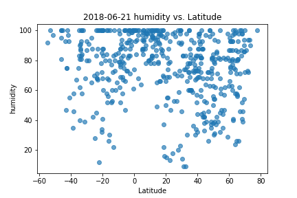

Analysis

    - Temperature seems to be highest among 20 to 30 degrees of latitude.
    - In most of the cities within -10 to 10 degrees of latitude, the humidity is above 50%
    - Cloudiness and wind speed doesn't really have any relationship with the latitude.


```python
import openweathermapy as owm
import pandas as pd
import numpy as np
from config import api_key
from citipy import citipy
import random
import matplotlib.pyplot as plt
```


```python
#Create list of random cities.

settings = {"units": "imperial", "appid": api_key}
city_list = []
weather_data= []
while len(weather_data)<500:
    r_lat = round(random.uniform(-90, 90),2)
    r_lng = round(random.uniform(-180, 180),2)
    city = citipy.nearest_city(r_lat,r_lng).city_name
    if not city in city_list:
        city_list.append(city)
        try:
            data = owm.get_current(city, **settings)
            weather_data.append(data)
            print(f"processing {city},{len(weather_data)}")
        except:
            pass
```

    processing kruisfontein,1
    processing yellowknife,2
    processing zyryanka,3
    processing la roda,4
    

```python
#Save it into Dataframe

city_index = [city['name'] for city in weather_data]
county = [city['sys']['country'] for city in weather_data]
lat = [city['coord']['lat'] for city in weather_data]
temp = [city['main']['temp'] for city in weather_data]
humidity = [city['main']['humidity'] for city in weather_data]
cloudiness = [city['clouds']['all'] for city in weather_data]
wind_speed = [city['wind']['speed'] for city in weather_data]

weather_df = pd.DataFrame({'city':city_index,'country':county,'lat':lat,'temp':temp,'humidity':humidity,'cloudiness':cloudiness,'wind_speed':wind_speed})
weather_df.to_csv("Results/Weather_df.csv")
weather_df.head(5)

```


<div>
<style scoped>
    .dataframe tbody tr th:only-of-type {
        vertical-align: middle;
    }

    .dataframe tbody tr th {
        vertical-align: top;
    }

    .dataframe thead th {
        text-align: right;
    }
</style>
<table border="1" class="dataframe">
  <thead>
    <tr style="text-align: right;">
      <th></th>
      <th>city</th>
      <th>cloudiness</th>
      <th>country</th>
      <th>humidity</th>
      <th>lat</th>
      <th>temp</th>
      <th>wind_speed</th>
    </tr>
  </thead>
  <tbody>
    <tr>
      <th>0</th>
      <td>Kruisfontein</td>
      <td>0</td>
      <td>ZA</td>
      <td>88</td>
      <td>-34.00</td>
      <td>57.34</td>
      <td>14.16</td>
    </tr>
    <tr>
      <th>1</th>
      <td>Yellowknife</td>
      <td>75</td>
      <td>CA</td>
      <td>40</td>
      <td>62.45</td>
      <td>73.40</td>
      <td>8.05</td>
    </tr>
    <tr>
      <th>2</th>
      <td>Zyryanka</td>
      <td>0</td>
      <td>RU</td>
      <td>26</td>
      <td>65.73</td>
      <td>75.07</td>
      <td>3.87</td>
    </tr>
    <tr>
      <th>3</th>
      <td>La Roda</td>
      <td>0</td>
      <td>ES</td>
      <td>52</td>
      <td>39.21</td>
      <td>69.80</td>
      <td>6.93</td>
    </tr>
    <tr>
      <th>4</th>
      <td>Woodland</td>
      <td>90</td>
      <td>US</td>
      <td>68</td>
      <td>45.91</td>
      <td>68.95</td>
      <td>5.82</td>
    </tr>
  </tbody>
</table>
</div>


```python
#Scatter plot (Temperature vs Latitude)

plt.scatter(weather_df['lat'],weather_df['temp'],alpha=0.675,marker='o')
plt.title("2018-06-21 Temperature (F) vs. Latitude")
plt.ylabel("Temperature (F)")
plt.xlabel("Latitude")
plt.savefig("Results/Temperature")
```


```python
#Scatter plot (Humidity vs Latitude)
plt.scatter(weather_df['lat'],weather_df['humidity'],alpha=0.675,marker='o')
plt.title("2018-06-21 humidity vs. Latitude")
plt.ylabel("humidity")
plt.xlabel("Latitude")
plt.savefig("Results/Humidity")
```





```python
#Scatter plot (Cloudiness vs Latitude)
plt.scatter(weather_df['lat'],weather_df['cloudiness'],alpha=0.675,marker='o')
plt.title("2018-06-21 cloudiness vs. Latitude")
plt.ylabel("cloudiness")
plt.xlabel("Latitude")
plt.savefig("Results/Cloudiness")
```


```python
#Scatter plot (Wind_Speed vs Latitude)
plt.scatter(weather_df['lat'],weather_df['wind_speed'],alpha=0.675,marker='o')
plt.title("2018-06-21 wind_speed vs. Latitude")
plt.ylabel("wind_speed")
plt.xlabel("Latitude")
plt.savefig("Results/Wind_Speed")
```


